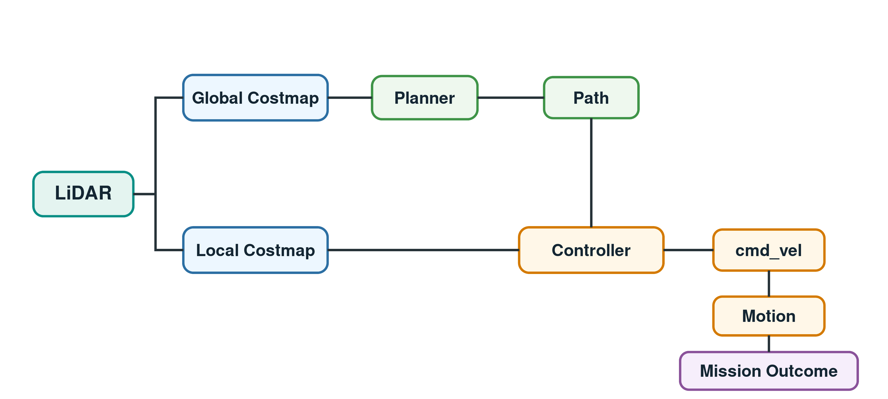
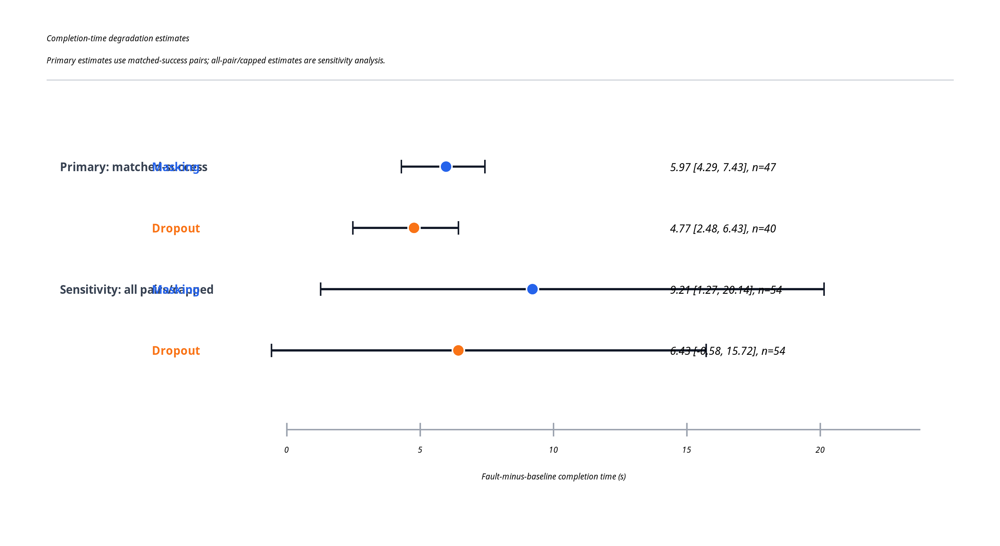

# ROS 2 Nav2 Fault Injection & Navigation Reliability

A ROS 2/Nav2 fault-injection and automated evaluation framework for studying how LiDAR degradation propagates through autonomous mobile robot navigation, from sensing to costmaps, planning, control, robot motion, and mission outcome.

**MSc Robotics dissertation project** built on The BARN Challenge ROS 2 benchmark.

**Tech:** Python | ROS 2 Jazzy | Nav2 | Gazebo | PyMC | pandas | NumPy | rosbag2 | MCAP

## Highlights

- Built parameterised ROS 2 LiDAR fault-injection nodes for Nav2 navigation experiments.
- Automated a 216-run paired fault campaign across 9 BARN environments.
- Implemented resumable experiment orchestration, cleanup handling, logging, parsing, and reproducibility checks.
- Analysed fault effects using paired comparisons, cluster-bootstrap confidence intervals, sensitivity analysis, and hierarchical Bayesian modelling.
- Built direct cross-layer tracing from `LaserScan` to costmap activity, planner/controller behaviour, `cmd_vel`, odometry-derived motion, and mission outcome.
- Implemented a lightweight conditional fault-type classifier and fault-specific recovery-policy selector.

## System View

<p align="center">
  
</p>

The framework injects controlled LiDAR faults into the scan stream consumed by Nav2, then measures how the effect appears across the downstream navigation stack.

## Main Result Snapshot

<p align="center">
  
</p>

Formal evaluation used two LiDAR fault models:

| Fault model | Primary matched-success slowdown | Evidence scope |
| --- | ---: | --- |
| Frontal LiDAR masking | +5.97 s, 95% CI [3.36, 8.46], n=47 | Stronger and more consistent slowdown evidence |
| Structured intermittent sector-level LiDAR dropout | +4.77 s, 95% CI [2.11, 7.03], n=40 | Positive slowdown evidence, more variable across worlds |

Sensitivity analysis retained all 54 paired runs per fault by assigning the 300 s cap to timeout/collision outcomes. This gave +9.21 s for masking and +6.43 s for dropout, and was treated as a robustness check rather than the primary completion-time estimate.

## My Contributions vs Upstream

| Component | Upstream BARN ROS 2 benchmark | My dissertation work |
| --- | ---: | ---: |
| BARN worlds and base simulation assets | Yes | Used as benchmark basis |
| ROS 2/Nav2 baseline launch structure | Yes | Tuned and integrated for controlled experiments |
| Frontal LiDAR masking injection | No | Yes |
| Intermittent sector-level LiDAR dropout injection | No | Yes |
| Automated paired campaign runner | No | Yes |
| Resumable execution, cleanup checks, and structured logging | No | Yes |
| Fault-campaign summarisation and analysis scripts | No | Yes |
| Cluster-bootstrap and Bayesian fault-effect analysis | No | Yes |
| Cross-layer direct propagation tracing | No | Yes |
| Conditional LiDAR fault-type classifier | No | Yes |
| Fault-specific exploratory recovery prototypes | No | Yes |
| Curated dissertation evidence index and manifest | No | Yes |

## What The Experiments Showed

- Fault impact was not captured well by success/failure alone: many runs still reached the goal but became slower, stopped more often, or showed changed controller behaviour.
- Frontal masking produced the clearest task-level degradation signal across the selected environments.
- Dropout was directionally harmful but more heterogeneous, which is visible in world-specific effects and posterior threshold probabilities.
- Environment geometry mattered: the same fault could have different practical impact depending on the world.
- The conditional episode-level fault classifier identified 4/4 held-out validation episodes within a 2 s observation window, with 0 wrong-type and 0 unknown decisions in that small held-out set.
- Recovery prototypes were intentionally treated as exploratory: they produced observable layer-specific effects, but did not demonstrate reliable mission-level improvement.

## Engineering Skills Demonstrated

- **ROS 2 system integration:** launch files, rclpy nodes, topics, QoS-aware sensor handling, Nav2/Gazebo wiring, and rosbag-based diagnostics.
- **Experiment automation:** resumable batch campaigns, paired experimental design, process cleanup, timeout handling, structured logs, and repeatable analysis outputs.
- **Reliability testing:** controlled fault injection, baseline-vs-fault comparison, fault realism ranking, stress/sanity checks, and explicit limitation tracking.
- **Data analysis:** paired statistics, world-level heterogeneity analysis, bootstrap uncertainty, hierarchical Bayesian modelling, posterior diagnostics, and sensitivity analysis.
- **Research communication:** curated evidence index, reproducible scripts, traceable experiment records, thesis-ready figures, and transparent reporting of weak or failed recovery attempts.

## Repository Map

| Path | Purpose |
| --- | --- |
| `jackal_helper/` | ROS 2 package containing launch integration, fault injectors, classifier nodes, and recovery prototype nodes |
| `tools/` | Experiment runners, campaign summarizers, analysis scripts, Bayesian scripts, classifier builders, and figure-generation scripts |
| `experiment_setups/` | Original and tuned Nav2 configurations used as controlled experiment conditions |
| `fault_campaigns/` | Formal campaign summaries, logs, per-world outputs, and thesis analysis tables |
| `dissertation_evidence_index/` | Curated final evidence: figures, Bayesian diagnostics, classifier validation, direct traces, recovery audits, and manifest |
| `docs/` | Methodology notes, classifier audit, packaging notes, and upstream README attribution |
| `research_notes/` | Development notes, weekly planning, appendix drafts, and experiment-record markdown files |

## Reproduce A Representative Run

```bash
source /opt/ros/jazzy/setup.bash
cd ~/dissertation/barn_ros2
colcon build --packages-select jackal_helper
source install/local_setup.bash

WS=~/dissertation/barn_ros2
TBCR=$WS/src/The-Barn-Challenge-Ros2

python3 $TBCR/tools/run_paired_fault_study.py \
  --world-idx 8 \
  --setup-path $TBCR/experiment_setups/tuned_clean \
  --log-dir $TBCR/manual_fault_runs/readme_smoke \
  --timeout 300 \
  --fault-type scan \
  --initial-pairs 1 \
  --pair-step 1 \
  --max-pairs 1 \
  --scan-fault-start 15 \
  --scan-fault-duration 20 \
  --scan-fault-mode mask \
  --scan-fault-center-deg 0 \
  --scan-fault-width-deg 90
```

## Evidence And Reproducibility

The Git repository is kept focused on source code, configuration, analysis scripts, and curated evidence. Large transfer bundles and raw rosbag archives are intentionally excluded from Git history and should be stored as GitHub Release assets or external archival files.

Useful entry points:

- `dissertation_evidence_index/README.md`: curated thesis evidence map.
- `dissertation_evidence_index/evidence_manifest.csv`: source paths, intended use, file sizes, and hashes.
- `GITHUB_ARCHIVE_GUIDE.md`: packaging and raw-data archive guidance.
- `docs/UPSTREAM_README.md`: original upstream BARN Challenge README preserved for attribution.

## Limitations

This was a dissertation-scale controlled simulation study, not a production safety system. The fault parameters are controlled experimental severity settings, not estimates of real-world fault distributions. The classifier and recovery components are lightweight exploratory prototypes; they are useful for demonstrating integration and layer-specific effects, but are not claimed as fully validated autonomous fault-tolerant navigation.

## Upstream And Attribution

This project extends [The BARN Challenge ROS 2 benchmark](https://github.com/Saadmaghani/The-Barn-Challenge-Ros2). The upstream benchmark provides the BARN worlds and base simulation framework. The fault injection, experiment orchestration, statistical analysis, fault identification, cross-layer tracing, recovery experiments, and curated dissertation evidence in this repository were developed for this MSc project.
